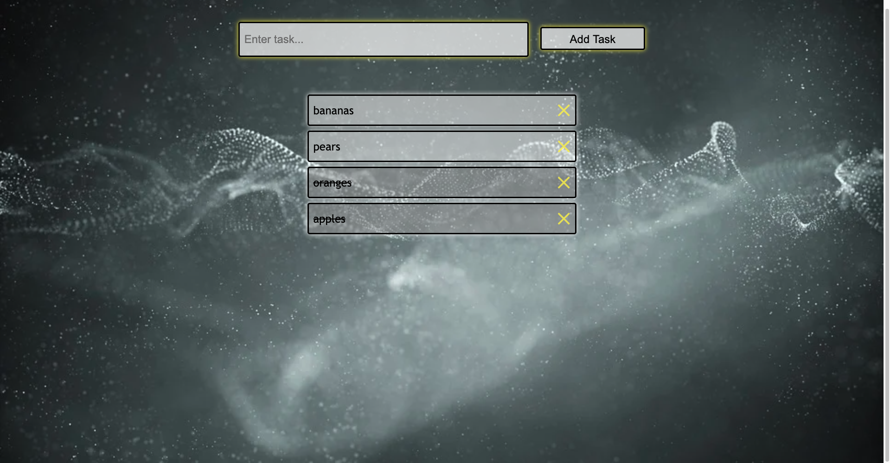

 

This is a simple interactive to-do list.  
Front-End: HTML, CSS, JS  
Back-End: Node.js, Express.js, MongoDB  
Items can be added and removed from the list, and marked as complete or not by clicking on them.  
The whole list is stored in a local MongoDB database.

Future features may include:  
    - Themes  
    - Multiple Users (sign-in)  
    - Multiple lists per user  
    - User able to re-order list

